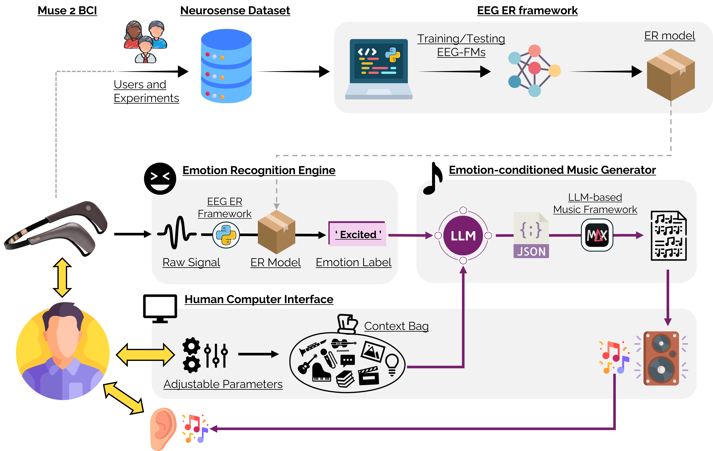
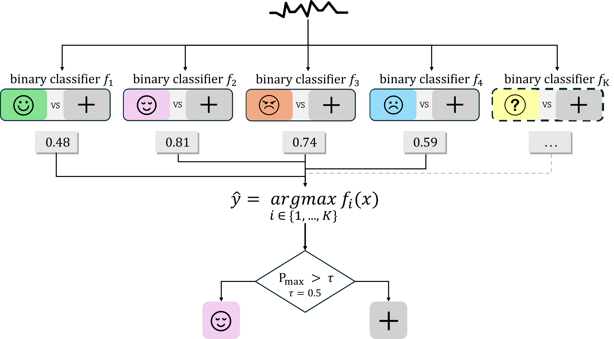
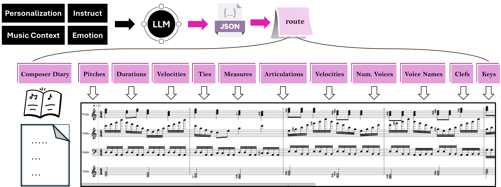
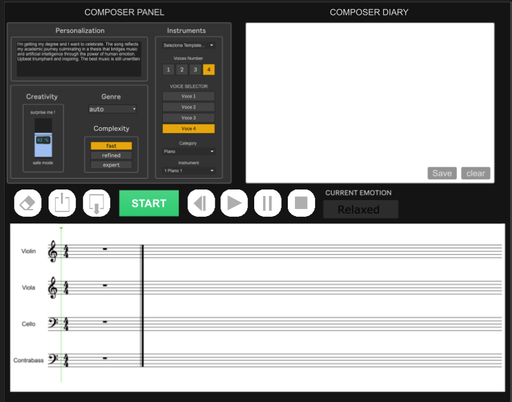

# NeuroMusicComposer 🧠🎶


An end-to-end cognitive-generative framework that bridges EEG emotion recognition and algorithmic music production. By coupling state-of-the-art EEG foundation models (Braindecode, Zyphra's Zuna) with Large Language Models (LLMs) and interactive audio systems (Max/MSP), this system translates neurophysiological states into complex, real-time musical compositions.

https://github.com/user-attachments/assets/2c53d714-9409-4f12-baef-5a07725b573c

## 🗺️ System Architecture

Our end-to-end ecosystem connects brain activity directly to algorithmic orchestration, building a real-time bio-feedback loop.



The framework operates across three highly decoupled layers:
1. **Neural Decoding Layer (`braindecode` & `zuna`):** Ingests raw EEG data, executes spatial-temporal filtering, and extracts emotional metrics using deep learning backbones.
2. **Cognitive Orchestration Layer (`emotion2music`):** Contextualizes the decoded affective states into structured musical prompts, negotiating orchestrational details using various state-of-the-art LLMs.
3. **Generative Audio Layer (`music_generator`):** A standalone real-time audio engine compiled via Max/MSP utilizing the *bach* automated notation library to synthesize the acoustic environment.

---

## 🧠 EEG Pipeline & Emotion Recognition

The neural decoding framework processes downsampled or upsampled EEG segments to compute classification thresholds across discrete baseline affective targets (Relaxed, Angry, Sad, Happy).



Using `braindecode` and MNE Python, the system maps physical EEG configurations (e.g., Muse 2) into high-resolution arrays. Advanced pipelines utilize the **Zuna Foundation Model** to reconstruct missing physical channels and compute **16 BIOT Bipolar derivations** (Anode/Cathode differentials) for enhanced affective state classification.

---

## 🎵 LLM Orchestration & Parameter Mapping

The cognitive layer acts as an algorithmic composer. It parses semantic features and physiological classifications into operational notation arrays processed by the music engine.



Through strict prompting strategies (Chain-of-Thought, RE2, Few-Shot), the LLM generates a highly structured **JSON payload**. This payload contains explicit musical parameters—such as Pitches, Durations, Velocities, Measures, Articulations, and Clefs—mapped directly to individual instrumental voices (e.g., Flute, Cello, Violin, Viola).

---

## 🧪 Experimental Benchmarks

The project includes an extensive benchmark suite organized within `emotion2music/experiments_study/`. Each experiment logs multi-model behaviors across varied prompt paradigms, evaluating how different LLM architectures (Claude, Gemini, GPT-4o) interpret the "Context Bag" (personalization and emotional tags).


| Study ID | Focus Area | Models Analyzed |
| :--- | :--- | :--- |
| `1_experiments_bestmodel` | Baseline Performance | Claude, GPT-4o, OpenRouter |
| `2_experiments_prompt_type` | Prompt Strategy | Claude Opus |
| `3_experiments_prompt_specificity`| Semantic Granularity | Claude Opus |
| `4_experiments_cot_diary` | Reasoning Behavior | Claude Opus/Sonnet/Haiku |
| `5_experiments_engineering` | RE2 & Few-Shot Tuning | Claude Opus/Sonnet |
| `7_experiments_gemini_live` | Foundation Model Tests | Gemini 2.5/3.1/3.5 |

---

## 💻 Interactive Interface

The compiled Max/MSP engine exposes a rich dashboard allowing full human-in-the-loop interaction alongside autonomous generation.



The **Composer Panel** offers parametric control over creativity, complexity, and instrumentation. The interface automatically renders the algorithmic output into standard Western music notation via the *bach* library, playing the synthesized score in real-time while displaying the LLM's cognitive reasoning in the "Composer Diary".

---

## 📊 Core Subsystem Matrix

| Subsystem Component | Key Script/Asset | Domain | Primary Technical Stack |
| :--- | :--- | :--- | :--- |
| **EEG Framework** | `braindecode/main_biot_bipolar.py` | Signal Decoding | PyTorch, Braindecode, MNE, Skorch |
| **Foundation Transform**| `braindecode/zuna_utils.py` | Data Processing | MNE Bipolar Referencing, Upsampling |
| **Prompt Engineering** | `emotion2music/prompts.py` | LLM Conditioning | RE2 Prompting, CoT, Few-Shot |
| **LLM Orchestration** | `emotion2music/llm_manager.py` | Cognitive Mapping| Google GenAI, Anthropic, OpenRouter |
| **Acoustic Engine** | `music_generator/music_generator.exe`| Real-time Synthesis| Max 8 Runtime, MSP, Jitter, *bach* |

---

## 🚀 Getting Started

### 1. Clone the Repository
Clone with the `--recursive` flag to pull all submodules:
```bash
git clone --recursive [https://github.com/maurofoglia/NeuroMusicComposer.git](https://github.com/maurofoglia/NeuroMusicComposer.git)
cd NeuroMusicComposer